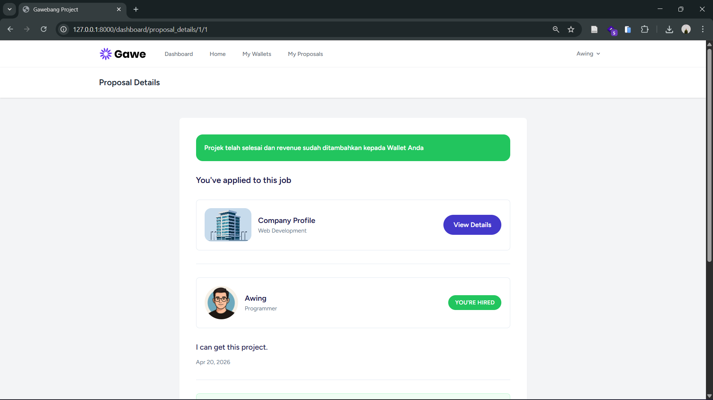

# Gawebang Project 🚀

<div align="center">

**Freelance Marketplace Platform - Connecting Clients & Freelancers**

[](https://laravel.com)
[](https://www.php.net)
[](https://www.mysql.com)
[](LICENSE)

**[Deskripsi](#deskripsi-proyek) • [Fitur](#fitur-utama) • [Tech Stack](#tech-stack) • [Instalasi](#instalasi) • [Setup Database](#setup-database)**

</div>

---

## 📝 Deskripsi Proyek

**Gawebang Project** adalah platform marketplace freelance yang menghubungkan klien dengan freelancer berkualitas untuk mengerjakan berbagai proyek secara online. Platform ini menyediakan ekosistem lengkap untuk mengelola project, melakukan bidding, komunikasi real-time, dan manajemen keuangan.

Dibangun dengan **Laravel 11**, **Tailwind CSS**, dan **MySQL** untuk memberikan pengalaman yang smooth, aman, dan scalable bagi semua pengguna.

---

## ✨ Fitur Utama

### � Sistem Autentikasi & Role Management

- ✅ Registrasi dan login user yang aman
- ✅ Role-based access control: **Client** dan **Freelancer**
- ✅ Profil user yang dapat dikustomisasi
- ✅ Email verification dan password recovery

### 📋 Project Management

- ✅ **Client** dapat membuat, mengedit, dan menghapus project
- ✅ Detail project lengkap: deskripsi, budget, category, skill requirements
- ✅ Project status tracking: draft, active, ongoing, completed
- ✅ Kategori project untuk filtering dan search
- ✅ Skill level requirements untuk freelancer

### 💼 Bidding System (Penawaran)

- ✅ **Freelancer** dapat mengajukan penawaran (bid) ke project yang tersedia
- ✅ Proposal dengan message/pitch untuk freelancer
- ✅ Status bidding: waiting, accepted, rejected, hired
- ✅ Track all bidding history untuk setiap project

### 🎯 Dashboard & User Panel

- ✅ **Client Dashboard**: overview project, bidding status, dan statistics
- ✅ **Freelancer Dashboard**: available projects, bidding history, earnings
- ✅ Activity log dan notification system
- ✅ Profile management untuk kedua role

### 💰 Wallet & Payment System

- ✅ Virtual wallet untuk setiap user
- ✅ Track semua transaksi keuangan
- ✅ Transaction history yang detail
- ✅ Secure payment processing

### 🏷️ Kategori & Tools Management

- ✅ Manajemen kategori project yang lengkap
- ✅ Skill/Tools management (teknologi yang digunakan)
- ✅ Filter dan search berdasarkan category dan tools
- ✅ Tagging system untuk reusable tools

---

## 🛠️ Tech Stack

### Backend

- **Framework**: Laravel 11
- **Language**: PHP 8.3+
- **Database**: MySQL 5.7+
- **Authentication**: Laravel Breeze
- **Permission**: Spatie Laravel Permission
- **Queue**: Database Driver

### Frontend

- **Build Tool**: Vite
- **CSS Framework**: Tailwind CSS 3.1
- **JavaScript**: Alpine JS 3.4
- **HTTP Client**: Axios

### Development & Testing

- **Testing**: PHPUnit 10.5
- **Code Quality**: Laravel Pint
- **Debugging**: Laravel Ignition
- **Faker**: Faker PHP (test data)

---

## 📋 Requirements

Pastikan sistem Anda memenuhi requirement berikut:

| Requirement  | Version |
| ------------ | ------- |
| **PHP**      | >= 8.3  |
| **MySQL**    | >= 5.7  |
| **Node.js**  | >= 16   |
| **Composer** | Latest  |
| **NPM**      | Latest  |

**Software yang diperlukan:**

- Git (untuk version control)
- Composer (untuk PHP dependencies)
- Node.js & NPM (untuk frontend build)
- XAMPP/Laragon/MAMP (untuk MySQL & PHP server)

---

## 🚀 Instalasi

### Step 1: Clone Repository

```bash
git clone https://github.com/Alwi31/gawebang-project
cd gawebang-project
```

### Step 2: Install PHP Dependencies

```bash
composer install
```

### Step 3: Install Frontend Dependencies

```bash
npm install
```

### Step 4: Setup Environment File

Copy `.env.example` ke `.env`:

```bash
cp .env.example .env
```

Atau buat `.env` baru dengan konfigurasi berikut.

### Step 5: Generate Application Key

```bash
php artisan key:generate
```

### Step 6: Setup Database (lihat bagian Setup Database)

---

## 🔐 Setup Environment (.env)

Edit file `.env` dan sesuaikan konfigurasi berikut:

### Database Configuration

```env
DB_CONNECTION=mysql
DB_HOST=127.0.0.1
DB_PORT=3306
DB_DATABASE=gawebang_project
DB_USERNAME=root
DB_PASSWORD=
```

### Application Configuration

```env
APP_NAME=GawebangProject
APP_ENV=local
APP_DEBUG=true
APP_URL=http://localhost:8000
APP_TIMEZONE=UTC

# Session Configuration
SESSION_DRIVER=database
SESSION_LIFETIME=120

# Cache Configuration
CACHE_STORE=database

# Queue Configuration
QUEUE_CONNECTION=database

# Mail Configuration
MAIL_MAILER=log
```

**⚠️ Tips Penting:**

- Untuk production: set `APP_DEBUG=false`
- Jangan commit `.env` ke repository (sudah di `.gitignore`)
- Gunakan `.env.production` untuk konfigurasi production
- Setup email SMTP untuk production (bukan `log`)

---

## 🗄️ Setup Database

### Option A: Menggunakan Migration (Recommended)

**Jalankan semua migration:**

```bash
php artisan migrate
```

**Tambahkan data dummy (opsional):**

```bash
php artisan db:seed
```

Database akan otomatis dibuat dengan semua tabel yang diperlukan.

### Option B: Import Database dari SQL File

Jika ada file backup database SQL:

1. **Buka phpMyAdmin** di `http://localhost/phpmyadmin`
2. **Buat database baru** dengan nama `gawebang_project`
3. **Klik database** yang baru dibuat
4. **Klik tab "Import"**
5. **Browse & pilih file** `.sql` dari folder project
6. **Klik tombol "Go"** untuk memulai import
7. **Tunggu proses selesai**

### Tabel Database yang Dibuat

```
users                    → User data (Client & Freelancer)
categories               → Kategori project
tools                    → Skill/Technology tools
projects                 → Project dari client
project_tools            → Relation antara project dan tools
project_applicants       → Bidding data dari freelancer
wallets                  → Virtual wallet user
wallet_transactions      → Transaction history
```

---

## ▶️ Menjalankan Project

### Development Mode

**Terminal 1 - Jalankan Laravel Server:**

```bash
php artisan serve
```

Akses di `http://localhost:8000`

**Terminal 2 - Jalankan Vite Dev Server (di terminal terpisah):**

```bash
npm run dev
```

Vite berjalan di `http://localhost:5173` untuk hot reload.

### Production Build

```bash
npm run build
php artisan config:cache
php artisan route:cache
php artisan view:cache
```

---

## 📁 Struktur Folder Penting

```
app/
├── Http/
│   ├── Controllers/
│   │   ├── DashboardController.php      # Dashboard untuk user
│   │   ├── ProjectController.php        # CRUD project
│   │   ├── ProjectApplicantController.php # Bidding system
│   │   ├── ProfileController.php        # User profile
│   │   ├── WalletController.php         # Wallet management
│   │   ├── CategoryController.php       # Category management
│   │   └── ToolController.php           # Tool management
│   └── Requests/                        # Form validation
│
├── Models/
│   ├── User.php                         # User model (Client & Freelancer)
│   ├── Project.php                      # Project model
│   ├── ProjectApplicant.php             # Bidding model
│   ├── Category.php
│   ├── Tool.php
│   ├── Wallet.php
│   └── WalletTransaction.php
│
└── Providers/                           # Service providers

database/
├── migrations/                          # Schema migrations
├── seeders/                             # Database seeders
└── sql/                                 # SQL backup files (jika ada)

resources/
├── views/                               # Blade templates
├── js/                                  # JavaScript files
└── css/                                 # CSS stylesheets

routes/
├── web.php                              # Web routes
└── auth.php                             # Auth routes

docs/
└── images/                              # Screenshot & documentation images

public/
└── assets/                              # Static assets (images, icons, etc)
```

---

## 📸 Screenshots

Letakkan screenshot UI Anda di folder `docs/images/` dan referensikan di bawah ini.

### Dashboard Client


_Halaman dashboard untuk client mengelola project dan bidding_

### Project Listing


_Halaman listing project yang tersedia untuk freelancer_

### Freelancer Bidding


_Interface untuk freelancer mengajukan bid/proposal_

### Wallet Management


_Panel wallet dengan transaction history_

### User Profile


_Profil user dengan informasi personal dan rating_

---

### 📸 Cara Menambahkan Screenshot

1. **Ambil screenshot** dari aplikasi Anda
2. **Simpan ke folder**: `docs/images/`
3. **Gunakan nama file** yang deskriptif (gunakan lowercase, hyphen-separated)
4. **Update README** dengan path lokal seperti contoh di atas

**Rekomendasi:**

- Ukuran: 1200x600px atau 800x600px
- Format: PNG atau JPG
- File size: < 500KB per image
- Contoh nama: `dashboard.png`, `project.png`, `bidding.png`

**Tools untuk capture screenshot:**

- Windows: ShareX (gratis), Snagit, Print Screen + Paint
- Mac: Screenshot built-in, Snagit
- Online: Placeholder images dari placeholder.com

---

## � Fitur & Improvement Rencana

### Current Features ✅

- ✅ User authentication dengan role management
- ✅ Project CRUD operations
- ✅ Bidding system untuk freelancer
- ✅ Dashboard untuk client & freelancer
- ✅ Wallet & payment system
- ✅ Category & tools management
- ✅ Profile management

### Future Improvements 🔮

- 🔄 Real-time notification system
- 📱 Mobile app (React Native/Flutter)
- ⭐ Rating & review system untuk freelancer
- 💬 Chat messaging system
- 📊 Advanced analytics dashboard
- 🔍 Recommendation engine
- 🌍 Multi-language support
- 📱 Push notifications
- 🔒 Two-factor authentication
- 📈 Advanced reporting & analytics

---

## 🧪 Testing

### Jalankan Unit Tests

```bash
php artisan test
```

### Jalankan Test dengan Coverage

```bash
php artisan test --coverage
```

### Test File Spesifik

```bash
php artisan test tests/Feature/ProjectTest.php
```

---

## 🐛 Troubleshooting

### Database Connection Error

**Error**: `SQLSTATE[HY000] [2002] No such file or directory`

**Solusi:**

```bash
# Pastikan MySQL running
# Edit .env dengan konfigurasi yang benar
DB_HOST=127.0.0.1
DB_DATABASE=gawebang_project
DB_USERNAME=root
DB_PASSWORD=

# Jalankan migrate
php artisan migrate
```

### Permission Denied Error

**Error**: `storage/logs/` atau `bootstrap/cache` permission denied

**Solusi:**

```bash
chmod -R 775 storage bootstrap/cache
chmod -R 775 public/storage
```

### Assets Not Loading

**Error**: CSS/JS tidak ter-load, halaman kosong

**Solusi:**

```bash
# Rebuild assets
npm run build

# Clear Laravel cache
php artisan cache:clear
php artisan config:clear
php artisan route:clear
php artisan view:clear
```

### Composer Issues

**Error**: `Call to undefined class` atau autoload error

**Solusi:**

```bash
composer dump-autoload
php artisan optimize:clear
```

---

## 🤝 Kontribusi

Kami menerima kontribusi untuk improve project! Caranya:

1. **Fork** repository ini
2. **Buat branch** feature (`git checkout -b feature/YourFeature`)
3. **Commit** changes (`git commit -m 'Add YourFeature'`)
4. **Push** ke branch (`git push origin feature/YourFeature`)
5. **Open Pull Request** dengan deskripsi clear

**Code Standards:**

- Ikuti PSR-12 PHP standard
- Write unit tests untuk fitur baru
- Update dokumentasi
- Jelaskan perubahan di PR description

---

## 📄 License

Project ini dilisensikan di bawah **MIT License** - lihat file [LICENSE](LICENSE) untuk detail lengkap.

---

## 👨‍💻 Author & Credits

**Gawebang Project** dikembangkan sebagai platform marketplace freelance.

### Acknowledgments

Terima kasih kepada:

- [Laravel](https://laravel.com) - Web framework PHP terbaik
- [Tailwind CSS](https://tailwindcss.com) - Utility-first CSS framework
- [Alpine.js](https://alpinejs.dev) - Lightweight JavaScript library
- [Spatie](https://spatie.be) - Laravel tools & packages
- [Vite](https://vitejs.dev) - Next generation frontend tooling

---

## 📞 Support & Contact

Untuk pertanyaan atau bug report:

- 📧 Email: support@gawebang.com
- 🐛 Issues: [GitHub Issues](https://github.com/Alwi31/gawebang-project/issues)
- 💬 Discussion: [GitHub Discussions](https://github.com/Alwi31/gawebang-project/discussions)

---

<div align="center">

### Made with ❤️ by Nizar Alwi


**Jika project ini bermanfaat, jangan lupa star! ⭐**

[Kembali ke Atas ⬆️](#gawebang-project-)

</div>
