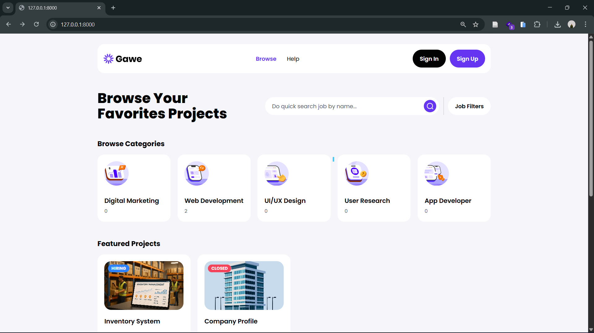
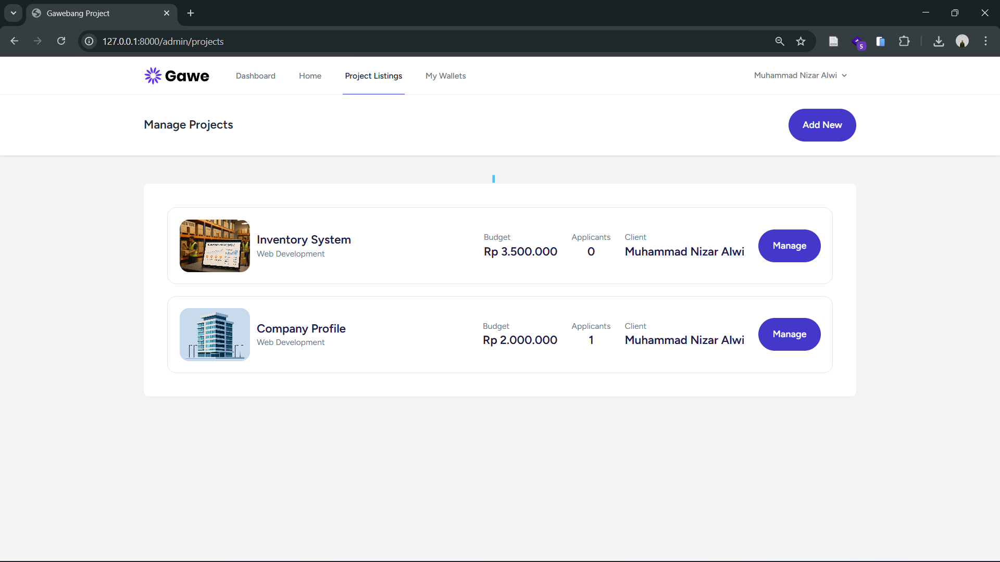
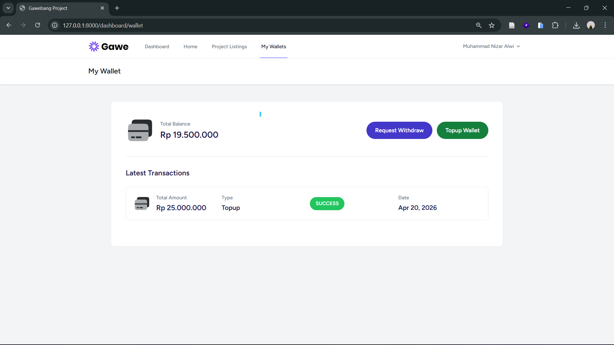
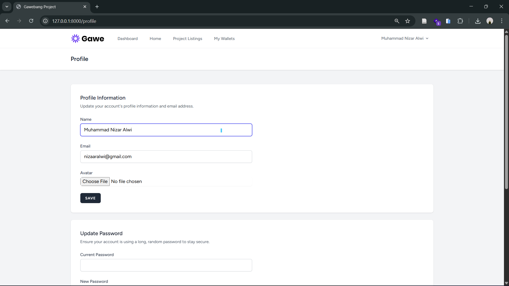
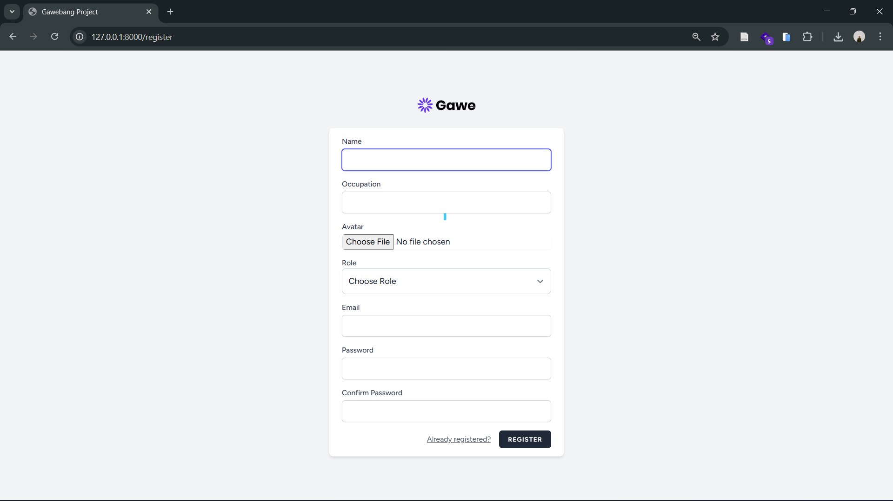

# Gawebang Project 🚀

<div align="center">

**Platform Kolaborasi Profesional untuk Project Development**

[](https://laravel.com)
[](https://www.php.net)
[](https://www.mysql.com)
[](LICENSE)

[📖 Dokumentasi](#-dokumentasi) • [🚀 Quick Start](#-quick-start) • [📋 Fitur](#-fitur-utama) • [🛠️ Tech Stack](#-tech-stack)

</div>

---

## 📝 Deskripsi Proyek

**Gawebang Project** adalah platform kolaborasi yang dirancang untuk memfasilitasi pengembangan proyek secara profesional dan efisien. Platform ini menyediakan sistem manajemen proyek, pengelolaan tim, tracking tools, dan sistem wallet terintegrasi untuk mengelola keuangan proyek dengan mudah.

Dibangun dengan **Laravel 11** sebagai backend framework yang robust, **Tailwind CSS** untuk UI yang modern, dan **MySQL** untuk database yang reliable.

---

## ✨ Fitur Utama

### 👥 User Management

- ✅ Registrasi dan login pengguna
- ✅ Profil pengguna yang dapat dikustomisasi
- ✅ Sistem role & permission berbasis Spatie Laravel Permission
- ✅ Password reset dan email verification

### 📁 Project Management

- ✅ Membuat dan mengelola proyek dengan deskripsi detail
- ✅ Set skill level requirement untuk project
- ✅ Assign multiple tools dan teknologi ke project
- ✅ Project status tracking

### 🛠️ Tools & Technologies

- ✅ Katalog tools/teknologi yang lengkap
- ✅ Tagging sistem untuk kategorisasi tools
- ✅ Quick access untuk reusable tools

### 💼 Aplikasi & Tim

- ✅ Pengguna dapat apply ke project yang tersedia
- ✅ Kelola aplikasi dan status approval
- ✅ Project team management

### 💰 Wallet System

- ✅ Virtual wallet untuk setiap pengguna
- ✅ Track semua transaksi keuangan
- ✅ History transaksi yang detail
- ✅ Secure payment processing

### 📊 Kategori Konten

- ✅ Sistem kategorisasi proyek dan tools
- ✅ Filtering dan searching berdasarkan kategori

---

## 🛠️ Tech Stack

### Backend

- **Framework**: Laravel 11
- **Language**: PHP 8.3+
- **Database**: MySQL 5.7+
- **Permission**: Spatie Laravel Permission v6.24
- **Queue**: Database Driver
- **Cache**: Database Driver

### Frontend

- **Build Tool**: Vite
- **CSS Framework**: Tailwind CSS 3.1
- **JavaScript**: Alpine JS 3.4
- **HTTP Client**: Axios

### Development Tools

- **Testing**: PHPUnit 10.5
- **Code Quality**: Laravel Pint
- **Debugging**: Laravel Ignition
- **Faker**: Faker PHP (untuk testing data)

### Additional

- **Authentication**: Laravel Breeze
- **Artisan CLI**: Laravel Tinker

---

## 📋 Prasyarat

Sebelum memulai, pastikan sistem Anda sudah memiliki:

- **PHP** >= 8.3
- **Composer** (untuk dependency management PHP)
- **Node.js** >= 16 dan **NPM** (untuk build frontend)
- **MySQL** >= 5.7
- **Git** (opsional, untuk version control)
- **Code Editor** (VS Code, PhpStorm, dll)

---

## 🚀 Panduan Instalasi

### Step 1: Clone Repository

```bash
git clone <repository-url>
cd gawebang-project
```

### Step 2: Install PHP Dependencies

```bash
composer install
```

### Step 3: Install Node Dependencies

```bash
npm install
```

### Step 4: Setup Environment Configuration

Copy file `.env.example` menjadi `.env`:

```bash
cp .env.example .env
```

Jika belum ada `.env.example`, gunakan template di bagian [Konfigurasi Environment](#⚙️-konfigurasi-environment-env).

### Step 5: Generate Application Key

```bash
php artisan key:generate
```

### Step 6: Setup Database

#### Option A: Import dari File SQL (jika tersedia)

1. **Buka phpMyAdmin** (di `http://localhost/phpmyadmin`)
2. **Buat database baru** dengan nama `gawebang_project`
3. **Klik pada database** yang baru dibuat
4. **Klik tab "Import"**
5. **Browse file** SQL dari folder `database/sql/` (jika ada)
6. **Klik tombol "Go"** untuk import
7. **Tunggu proses selesai**

#### Option B: Menggunakan Migration (Recommended)

```bash
php artisan migrate
```

Jika ingin menambahkan data dummy untuk testing:

```bash
php artisan db:seed
```

---

## ⚙️ Konfigurasi Environment (.env)

Edit file `.env` di root project dan sesuaikan konfigurasi berikut:

```env
# App Configuration
APP_NAME=GawebangProject
APP_ENV=local
APP_DEBUG=true
APP_URL=http://localhost:8000
APP_TIMEZONE=UTC

# Database Configuration
DB_CONNECTION=mysql
DB_HOST=127.0.0.1
DB_PORT=3306
DB_DATABASE=gawebang_project
DB_USERNAME=root
DB_PASSWORD=              # Kosongkan jika password default MySQL kosong

# Session Configuration
SESSION_DRIVER=database
SESSION_LIFETIME=120

# Cache Configuration
CACHE_STORE=database
CACHE_PREFIX=

# Queue Configuration
QUEUE_CONNECTION=database

# Mail Configuration (opsional)
MAIL_MAILER=log
MAIL_HOST=smtp.mailtrap.io
MAIL_PORT=587
MAIL_USERNAME=your_username
MAIL_PASSWORD=your_password
MAIL_FROM_ADDRESS=noreply@gawebang.com
MAIL_FROM_NAME="Gawebang Project"

# Broadcast
BROADCAST_CONNECTION=log

# Filesystem
FILESYSTEM_DISK=local
```

**⚠️ Tips Penting:**

- Set `APP_DEBUG=false` untuk production
- Gunakan file `.env.production` terpisah untuk konfigurasi production
- **Jangan commit file `.env` ke repository** (sudah di `.gitignore`)
- Selalu gunakan environment variable untuk secret key

---

## 🔧 Menjalankan Project

### Mode Development (Hot Reload)

**Terminal 1 - Jalankan PHP Server:**

```bash
php artisan serve
```

Server akan berjalan di `http://localhost:8000`

**Terminal 2 - Jalankan Vite Development Server:**

```bash
npm run dev
```

Vite akan berjalan di `http://localhost:5173`

Akses aplikasi di browser: **http://localhost:8000**

### Build untuk Production

```bash
# Build frontend assets
npm run build

# Run migrations di environment production
php artisan migrate --env=production

# Clear all caches
php artisan cache:clear
php artisan config:clear
php artisan route:clear
php artisan view:clear
```

---

## 📁 Struktur Folder

```
gawebang-project/
├── app/
│   ├── Http/
│   │   ├── Controllers/          # Request handlers & business logic
│   │   └── Requests/             # Form validation rules
│   ├── Models/                   # Database Eloquent models
│   │   ├── User.php
│   │   ├── Project.php
│   │   ├── Category.php
│   │   ├── Tool.php
│   │   ├── ProjectApplicant.php
│   │   ├── Wallet.php
│   │   ├── WalletTransaction.php
│   │   └── ProjectTool.php
│   ├── Observers/                # Model event observers
│   └── Providers/                # Service providers
│
├── bootstrap/                    # Framework bootstrap files
├── config/                       # Configuration files
│   ├── app.php                   # Application config
│   ├── auth.php                  # Authentication config
│   ├── database.php              # Database config
│   ├── permission.php            # Permission/role config
│   └── ...
│
├── database/
│   ├── migrations/               # Database schema migrations
│   │   └── *_create_*_table.php
│   ├── seeders/                  # Database seeders
│   │   ├── DatabaseSeeder.php
│   │   └── RolePermissionSeeder.php
│   ├── factories/                # Model factories for testing
│   └── sql/                      # SQL backup files (jika ada)
│
├── public/                       # Web server root directory
│   ├── assets/                   # Static assets
│   │   ├── icons/
│   │   ├── logos/
│   │   ├── photos/
│   │   └── thumbnails/
│   ├── build/                    # Compiled assets from Vite
│   │   └── manifest.json
│   ├── css/                      # Compiled CSS output
│   └── index.php                 # Entry point
│
├── resources/
│   ├── js/                       # Frontend JavaScript
│   │   ├── app.js
│   │   └── bootstrap.js
│   ├── css/                      # Source CSS files
│   │   └── app.css
│   └── views/                    # Blade templates
│       └── ...
│
├── routes/
│   ├── web.php                   # Web routes
│   ├── auth.php                  # Authentication routes
│   └── console.php               # Console commands
│
├── storage/                      # Application storage
│   ├── app/                      # File uploads
│   ├── framework/                # Framework generated files
│   └── logs/                     # Application logs
│
├── tests/                        # Unit & Feature tests
│   ├── TestCase.php
│   ├── Feature/
│   └── Unit/
│
├── vendor/                       # Composer dependencies
├── node_modules/                 # NPM dependencies
│
├── .env                          # Environment variables (local)
├── .env.example                  # Environment template
├── composer.json                 # PHP dependencies definition
├── package.json                  # Node dependencies definition
├── vite.config.js                # Vite bundler configuration
├── tailwind.config.js            # Tailwind CSS configuration
├── phpunit.xml                   # PHPUnit test configuration
├── artisan                       # Laravel CLI executable
└── README.md                     # This file
```

---

## 📸 Screenshots

Berikut adalah area untuk menampilkan UI screenshots project Anda:

### 🏠 Dashboard


_Halaman utama dengan overview statistik project_

### 📊 Project Management


_Interface untuk membuat dan mengelola projects serta assign tools_

### 💰 Wallet System


_Sistem wallet dengan history transaksi dan balance management_

### 👤 User Profile


_Profil pengguna dengan role, permissions, dan informasi personal_

### 🔐 Authentication


_Halaman login dan register dengan validasi form_

---

## 📚 Database Architecture

### Entity Relationship Diagram

```
User
  ├─── 1:N ─── Project (as creator)
  ├─── M:N ─── ProjectApplicant (applied projects)
  ├─── 1:N ─── Wallet
  └─── 1:N ─── WalletTransaction

Project
  ├─── M:N ─── Tool (via ProjectTool)
  ├─── 1:N ─── ProjectTool
  ├─── 1:N ─── ProjectApplicant
  ├─── N:1 ─── Category
  └─── N:1 ─── User (creator)

Tool
  ├─── M:N ─── Project
  ├─── N:1 ─── Category
  └─── 1:N ─── ProjectTool

Category
  ├─── 1:N ─── Project
  └─── 1:N ─── Tool

Wallet
  ├─── N:1 ─── User
  └─── 1:N ─── WalletTransaction

WalletTransaction
  └─── N:1 ─── Wallet
```

### Permission System

Project menggunakan **Spatie Laravel Permission** dengan struktur:

```
Roles:
  - Admin           → Full access ke semua fitur
  - Project Manager → Mengelola project dan team
  - User            → Membuat project dan apply ke project lain

Permissions:
  - view-projects
  - create-project
  - edit-project
  - delete-project
  - manage-tools
  - manage-wallet
  - approve-applicant
  - ... dll
```

---

## 🧪 Testing

### Jalankan Unit Test

```bash
php artisan test
```

### Jalankan Test dengan Coverage Report

```bash
php artisan test --coverage
```

### Jalankan Test untuk File Spesifik

```bash
php artisan test tests/Feature/ProjectTest.php
```

---

## 🐛 Troubleshooting

### 1. Database Connection Error

**Masalah**: `SQLSTATE[HY000] [2002] No such file or directory`

**Solusi:**

```bash
# Pastikan MySQL service sudah berjalan
# Windows: MySQL service di Services
# macOS: brew services start mysql
# Linux: sudo systemctl start mysql

# Cek konfigurasi .env
DB_HOST=127.0.0.1      # atau localhost
DB_USERNAME=root
DB_PASSWORD=           # kosong jika default

# Buat database jika belum ada
# Di phpMyAdmin atau MySQL CLI:
# CREATE DATABASE gawebang_project;

# Jalankan migration ulang
php artisan migrate:fresh
```

### 2. Permission Denied Error

**Masalah**: `The stream or file "/storage/logs/..." could not be opened`

**Solusi:**

```bash
# Set permission untuk storage dan bootstrap/cache
chmod -R 775 storage bootstrap/cache
chmod -R 775 public/storage

# Windows (jika menggunakan Git Bash):
# Jalankan Command Prompt sebagai Administrator, kemudian:
# Tidak perlu chmod di Windows, permission sudah handled
```

### 3. Assets Not Loading (Blank Page)

**Masalah**: Stylesheet dan JavaScript tidak ter-load

**Solusi:**

```bash
# Rebuild frontend assets
npm run build

# Clear Laravel cache
php artisan cache:clear
php artisan config:clear
php artisan route:clear
php artisan view:clear

# Restart Laravel server
php artisan serve
```

### 4. Composer Autoload Issues

**Masalah**: `Call to undefined function` atau `Class not found`

**Solusi:**

```bash
# Regenerate autoload files
composer dump-autoload

# Optimize for production
php artisan optimize
php artisan optimize:clear  # jika perlu reset
```

### 5. npm Module Not Found

**Masalah**: `Cannot find module 'vite'` atau npm errors

**Solusi:**

```bash
# Clear npm cache
npm cache clean --force

# Reinstall dependencies
rm -rf node_modules package-lock.json
npm install

# Jalankan dev server
npm run dev
```

---

## 🤝 Kontribusi

Kami menerima kontribusi untuk improve project ini! Berikut caranya:

1. **Fork** repository
2. **Buat branch** feature (`git checkout -b feature/AmazingFeature`)
3. **Commit** changes (`git commit -m 'Add some AmazingFeature'`)
4. **Push** ke branch (`git push origin feature/AmazingFeature`)
5. **Open Pull Request** dengan deskripsi yang jelas

**Guidelines:**

- Pastikan code mengikuti PSR-12 standard
- Tulis unit test untuk fitur baru
- Update dokumentasi jika ada perubahan API
- Jelaskan perubahan Anda dalam PR description

---

## 📄 License

Project ini dilisensikan di bawah **MIT License** - lihat file [LICENSE](LICENSE) untuk detail lengkap.

---

## 👨‍💻 Author & Credits

**Gawebang Project** dikembangkan oleh tim development.

### Acknowledgments & Credits

Terima kasih kepada:

- [Laravel](https://laravel.com) - Web application framework terbaik
- [Tailwind CSS](https://tailwindcss.com) - Utility-first CSS framework
- [Alpine.js](https://alpinejs.dev) - Lightweight JavaScript framework
- [Spatie](https://spatie.be) - Laravel Permission & tools berkualitas tinggi
- [Vite](https://vitejs.dev) - Next generation frontend tooling

---

## 📞 Kontak & Support

Untuk pertanyaan, bug report, atau suggestions:

- 📧 **Email**: support@gawebang.com
- 🐛 **Issue Tracker**: [GitHub Issues](https://github.com/Alwi31/gawebang-project/issues)
- 💬 **Discussions**: [GitHub Discussions](https://github.com/Alwi31/gawebang-project/discussions)

---

## 📅 Changelog

### Version 1.0.0 (Initial Release)

- ✅ User authentication & authorization
- ✅ Project management system
- ✅ Tools & technology management
- ✅ Wallet & transaction system
- ✅ Project applicant tracking
- ✅ Role-based permission system
- ✅ Database migrations & seeders
- ✅ Responsive UI dengan Tailwind CSS

---

<div align="center">

### Made with ❤️ by Nizar Alwi


⭐ **Jika project ini bermanfaat, jangan lupa untuk star!** ⭐

[Kembali ke atas ⬆️](#gawebang-project-)

</div>
